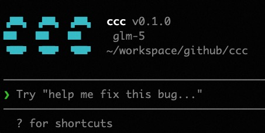

# ccc

ccc（**C**laude **C**ode in **C**++）是一个用 C++ 实现的 Claude Code 命令行工具，通过实现一个功能相似的 CLI 工具来学习和理解 Claude Code 的工作原理。



## 功能特性

- **Agent Loop** — 基于 ReAct 模式的智能体循环，支持多轮工具调用与流式输出
- **双 API 支持** — 同时兼容 Anthropic 和 OpenAI 两种 API 格式
- **内置工具** — Read、Write、Edit、Bash、Glob、Grep 六种核心工具
- **权限系统** — 只读操作自动放行，危险操作需用户确认
- **Memory 系统** — 自动加载 CLAUDE.md 项目指令注入系统提示
- **上下文压缩** — 对话历史过长时自动摘要压缩，保留最近消息
- **Skill 系统** — 支持 `/commit`、`/help` 等斜杠命令
- **任务管理** — 内置 TaskCreate、TaskUpdate、TaskList 工具
- **终端 UI** — 基于 FTXUI 的全屏 TUI 界面

## 快速开始

### 构建

```bash
cmake -B build
cmake --build build
```

依赖库通过 CMake FetchContent 自动下载，无需手动安装。

### 配置

创建配置文件 `~/.ccc/settings.json`：

```json
{
  "provider": "anthropic",
  "api_key": "your-api-key",
  "model": "claude-sonnet-4-20250514"
}
```

也支持通过环境变量配置：`API_PROVIDER`、`ANTHROPIC_API_KEY`、`OPENAI_API_KEY`、`API_BASE_URL`、`MODEL`。

### 运行

```bash
# 交互模式
./build/ccc

# 单次模式
./build/ccc "帮我读一下 main.cpp"
```

## 项目结构

```
src/
├── main.cpp              # 入口
├── agent.cpp/hpp         # Agent 循环核心
├── api_client.cpp/hpp    # API 客户端（Anthropic / OpenAI）
├── context_manager.*     # 上下文压缩与 token 计数
├── memory.*              # CLAUDE.md 加载
├── permission.*          # 权限系统
├── skill_manager.*       # Skill 斜杠命令
├── task_manager.*        # 任务管理
├── ui.*                  # FTXUI 终端界面
├── tool.hpp              # Tool 基类与注册表
└── tools/                # 内置工具实现
    ├── read_tool.*
    ├── write_tool.*
    ├── edit_tool.*
    ├── bash_tool.*
    ├── glob_tool.*
    ├── grep_tool.*
    └── task_*_tool.hpp
docs/                     # 设计文档（中文）
tests/                    # 单元测试（Google Test）
```

## 依赖

| 库 | 用途 |
|---|---|
| [cpp-httplib](https://github.com/yhirose/cpp-httplib) | HTTP 客户端 |
| [nlohmann/json](https://github.com/nlohmann/json) | JSON 解析 |
| [FTXUI](https://github.com/ArthurSonzogni/FTXUI) | 终端 UI |
| [Google Test](https://github.com/google/googletest) | 单元测试 |

需要 C++17 及 OpenSSL（HTTPS 支持）。

## 测试

```bash
cd build && ctest
```

## 文档

`docs/` 目录下包含详细的中文设计文档，涵盖核心功能分析、Agent Loop、工具系统、权限系统、Memory 系统等。

## License

MIT
